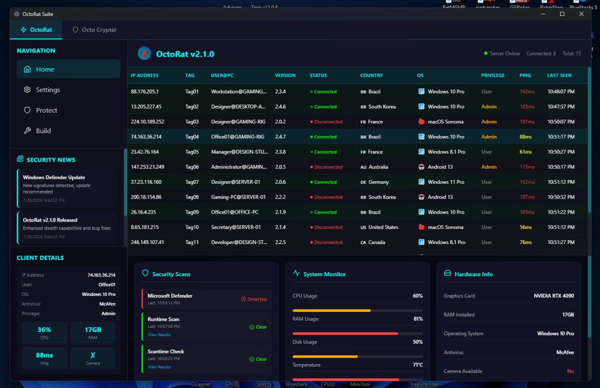

# 🐙 OCTO RAT  
### Multi-Panel Command & Control Suite  

OCTO RAT is a precision-built, high-resilience remote administration toolkit designed for advanced operational flexibility. Featuring a multi-panel architecture, OCTO RAT enables streamlined command execution, real-time telemetry access, and total endpoint domination.

Whether you're managing a red team operation or maintaining advanced access in complex networks, OCTO RAT delivers surgical control without compromise.

> 💬 **Interested? Message [@zerotrace_00](https://t.me/zerotrace_00) on Telegram for access.**

---

## 📸 Interface Preview

  
  
  
  
  
  
  
  
  
  

---

## ⚙️ Core Capabilities

| Module               | Functionality Description |
|----------------------|---------------------------|
| **Remote Desktop**   | Full interactive GUI session in real-time with scaling and input control |
| **Remote Shell**     | Interactive shell with system-level execution |
| **System Info**      | Detailed hardware, software, and user profile inventory |
| **Network Info**     | Active connections, DNS cache, gateway & adapter data |
| **Webcam Access**    | Stream or snapshot from active camera devices |
| **Microphone Stream**| Live mic feed capture with buffered fallback |
| **Screen Capture**   | High-resolution desktop screenshots with configurable intervals |
| **Keylogger**        | Low-level input capturing (Unicode supported) |
| **File Manager**     | Browse, upload, download, execute, and delete files silently |
| **Password Recovery**| Extract credentials from browsers, FTP clients, and system vaults |
| **Registry Editor**  | Read/write/delete keys; monitor critical hives |
| **Process Manager**  | View, kill, suspend, or inject into active processes |
| **Restart Computer** | Graceful or forced reboot with optional delay |
| **Shutdown Computer**| Instantly power off target system |
| **Disconnect Client**| Manual implant removal with cleanup options |

---

## 🔐 Defensive Evasion

| Technique            | Description |
|----------------------|-------------|
| **Anti-VM**          | Detects virtualized environments and evades sandboxing traps |
| **Anti-Sandbox**     | Recognizes dynamic analysis and exits silently |
| **Anti-Debugger**    | Obfuscates runtime flow and self-destructs if traced |
| **Process Mutation** | Randomized in-memory mutations and unique builds |
| **Code Obfuscation** | Encrypted strings, junk insertion, polymorphic engines |

---

## 🧬 Persistence & Survivability

| Mechanism              | Description |
|------------------------|-------------|
| **Auto Startup**       | Executes on boot (user/system level) |
| **Service Installation**| Runs as hidden system-level service |
| **Registry Persistence**| Creates persistent autorun keys with ACL shielding |
| **Task Scheduler**     | Scheduled reboots or secondary triggers |
| **Watchdog Process**   | Self-repairing through child/parent process cycling |

---

## 🕵️ Covert Ops Suite

| Stealth Feature         | Description |
|--------------------------|-------------|
| **Encrypted Comms**      | AES + Curve25519 encrypted channels |
| **Domain Fronting**      | Obfuscate C2 routes via major CDN endpoints |
| **Proxy Chaining**       | Dynamic multi-hop over SOCKS5/Tor |
| **DNS over HTTPS**       | Secure, unlogged domain resolution |
| **Jitter Timing**        | Randomized beacon intervals for traffic blending |
| **Process Hiding**       | Injected threads hidden from Task Manager |
| **Network Stealth**      | Mimics legitimate TLS/HTTP traffic |
| **Filesystem Stealth**   | ADS streams, hidden directories, and masquerading |
| **Registry Protection**  | Concealed keys with ACL hardening |
| **Timestamp Spoofing**   | Matches legit file timestamps to avoid detection |

---

## 💥 Integrated Crypter (Built-in)

- AES + ChaCha Hybrid Encryption  
- Dynamic Stub Generator  
- RunPE Injection  
- File Pumper  
- Binder (Multi-file combo)  
- Icon Changer  
- EOF Preservation  
- Anti-Scan Obfuscation  
- Delay Execution + Junk Layers

---

## 💻 Platform Support

| OS            | Status        |
|---------------|---------------|
| **Windows 11**    | ✅ Supported |
| **Windows 10**    | ✅ Supported |
| **Windows 8.1**   | ✅ Supported |
| **Windows 8**     | ✅ Supported |
| **Windows 7**     | ✅ Supported |
| **Windows XP**    | ✅ Supported |
| **macOS**         | ✅ Supported |
| **Android 13+**   | ✅ Supported |

---

## 🛠 Deployment & Support

Every subscription includes:

- Private client-only support access  
- Ongoing updates and new module drops  
- Custom C2 assistance (Cloudflare, self-hosted, fast deploy)  
- Professional-grade security hardening consulting

---

## ⚠️ Legal Notice

> **OCTO RAT** is strictly intended for legal penetration testing, authorized red teaming, security research, and educational use. Misuse against unauthorized systems is illegal and punishable under international law. The responsibility lies solely on the end-user. Know what you’re doing.

---
